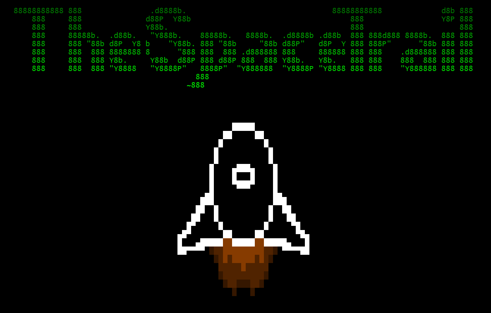

# The Space Trail

 

# How to play

Run the command `pip install rich` in your terminal.

### Cross Platform
Run `python -m src_tst`.

To bypass the intro sequence run `python -m src_tst.ignore`.

# Problems/Questions

## I'm having trouble with rich compatibility
We used `rich==14.3.3`, so install the version we used with `pip install rich==14.3.3`. We also require a minimum vertical terminal size of 20, and horizontal size of 110. You can ignore this limitation by running `python -m src_tst.ignore`.

## Can I contribute?
Go right ahead! I would not wish refactoring this code on my worst enemy but esoteric programming languages attract a certain kind of person.
We coded the parser to be quite lightweight, so you can make your own projects in CEJBSBDSL although, it is a terrible language.

